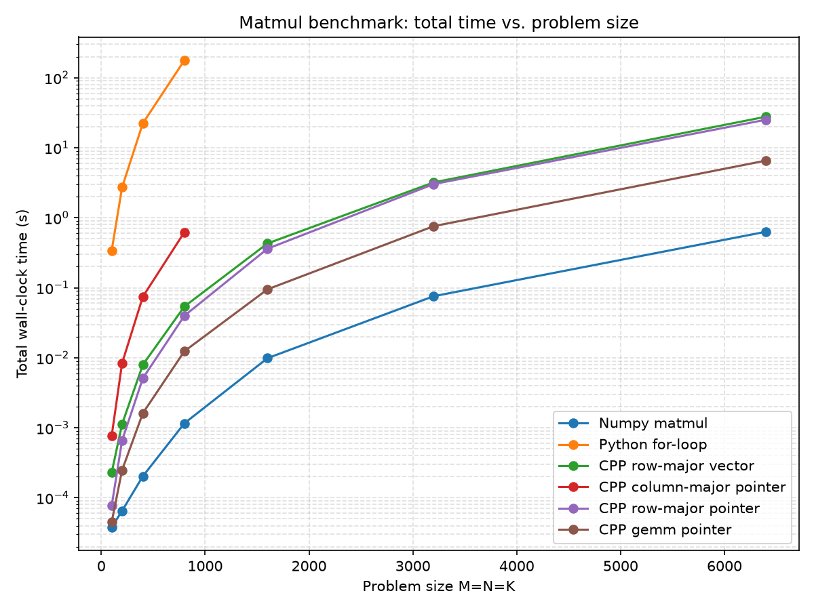
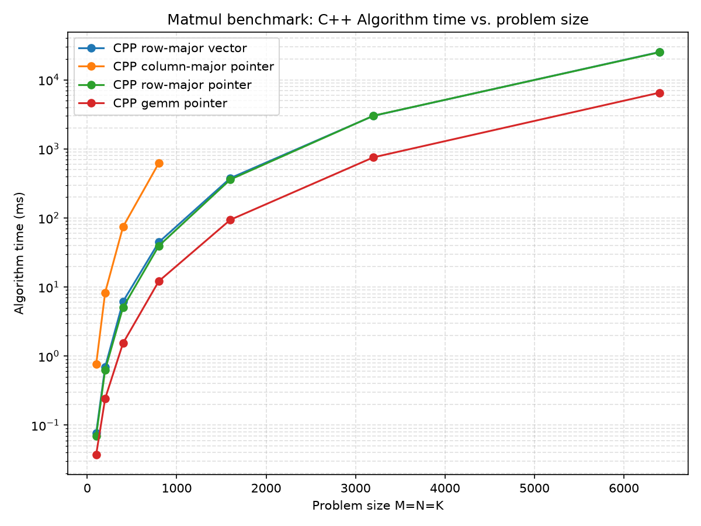
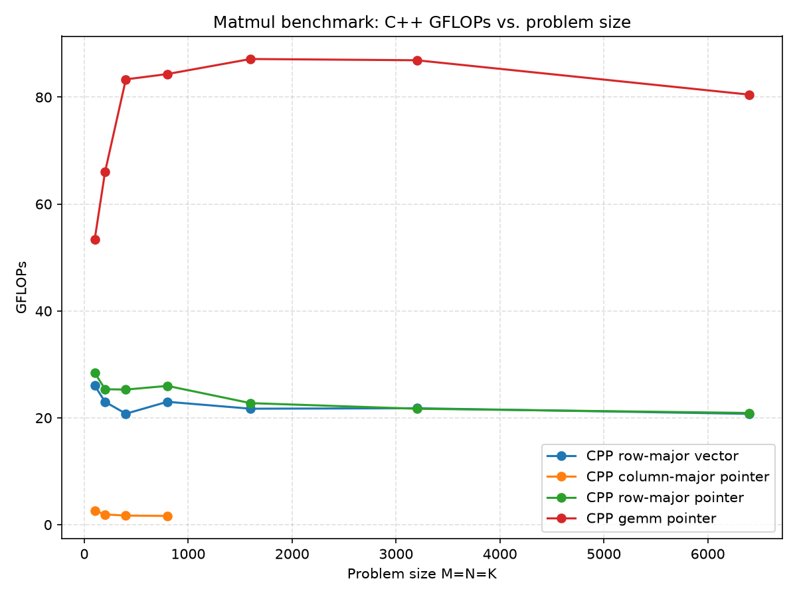

# Benchmark Results

Matrix multiplication:

C (M, N) = A (M, K) x B (K, N)

with dimension (M, N, K) ranges from (100, 100, 100) to (6400, 6400, 6400).

## Hardware

- MacOS : Tahoe 26
- Chip : M1
- L1 / L2 : 128 KB / 12MB
- Cache Line Size : 128 B
- Register: 128 bit / register; 24 caller-saved + 8 callee-saved 

## Implementations

| Method | Data structure | Loop order | Notes |
|---|---|---|---|
| Python for-loop | nested `list` | i-j-k | reference baseline, skipped past a certain size |
| CPP row-major vector | `std::vector<std::vector<T>>` | i-k-j | jagged rows, double pointer indirection per access |
| CPP column-major pointer | flat buffer, raw pointer | i-j-k | strided (non-contiguous) inner-loop access on `B` |
| CPP row-major pointer | flat buffer, raw pointer | i-k-j | contiguous inner-loop access on `B` and `C`. |
| CPP GEMM pointer | flat buffer, raw pointer | - | macro-panels (block) packed in row-major order; micro-panels (tile) with 21 registers used |

- Row/Column-major:
    
    - Column-major
    
    ```cpp
    for i : M
        for j : N
            for k : K
                C[i][j] += A[i][k] * B[k][j]
    ```

    - Row-major

    ```cpp
    for i : M
        for k : K
            for j : N
                C[i][j] += A[i][k] * B[k][j]
    ```

- Zero-copy: Using `py::array_t<T>` to handle data from the Python side avoids the costly conversion between a Python `list` and a C++ `vector`.

- GEMM Cross product: Instead of using the conventional dot product of A and B to compute C, I use cross product (rank-1 updates) to reduce memory loading. For example, a (M, N, K) = (3, 2, 4) matrix multiplication, initializing C to zeros(3, 2):

    ```text
    Update-1:
    ⎡ c11  c12 ⎤      ⎡a11⎤
    ⎢ c21  c22 ⎥  +=  ⎢a21⎥ x [b11 b12]
    ⎣ c31  c32 ⎦      ⎣a31⎦

    Update-2:
    ⎡ c11  c12 ⎤      ⎡a12⎤
    ⎢ c21  c22 ⎥  +=  ⎢a22⎥ x [b21 b22]
    ⎣ c31  c32 ⎦      ⎣a32⎦

    Update-3:
    ⎡ c11  c12 ⎤      ⎡a13⎤
    ⎢ c21  c22 ⎥  +=  ⎢a23⎥ x [b31 b32]
    ⎣ c31  c32 ⎦      ⎣a33⎦

    Update-4:
    ⎡ c11  c12 ⎤      ⎡a14⎤
    ⎢ c21  c22 ⎥  +=  ⎢a24⎥ x [b41 b42]
    ⎣ c31  c32 ⎦      ⎣a34⎦
    ```
    There are 4 updates of the C matrix in total. With the help of registers, C only needs to be loaded before update-1 and saved back after update-4, costing 2 x 3 x 2 total load/save for C, plus 4 x (3 + 2) for A and B. In general this is 2MN + K(M + N) total load/save, compared to (2 + 2K)MN in conventional dot-product matrix multiplication. For A and B loading part, the cross-product reduces the number of memory accesses by $\frac{2MNK}{K(M + N)} = \frac{2MN}{M + N}$ with respect to the dot product.

- GEMM Packing: To take advantage of cache contiguity and the cross-product algorithm, I pack both macro-panels of A and B into row-major arrays:

    ```text
    ⎡ a11 a12 a13 a14 ⎤  pack
    ⎢ a21 a22 a23 a24 ⎥ -----> [a11 a21 a31 a12 a22 a32 a13 a23 a33 a14 a24 a34]
    ⎣ a31 a32 a33 a34 ⎦

    ⎡ b11 b12 ⎤
    ⎢ b21 b22 ⎥  pack
    ⎢ b31 b32 ⎥ -----> [b11 b12 b21 b22 b31 b32 b41 b42]
    ⎣ b41 b42 ⎦
    ```

- GEMM Block/Tile: Because of hardware constraints (limited cache size, number of registers), the big matrix is split from (M, N, K) into macro-panels (MC, NC, KC), and finally into micro-panels (MR, NR) for SIMD.

    ```cpp
    for jp : N
        for kp : K
            pack macro-panel blockB[KC x NC]
            for ip : M
                pack macro-panel blockA[MC x KC]
                for ir : MC
                    for jr : NC
                        SIMD on micro-panel tileC[MR x NR] with blockA, blockB
    ```

## Benchmark methodology

- **A one-time warm-up call per algorithm in Epoch 0.**

- **Wall clock and algorithm timing.**
  Wall clock is measured for each algorithm in the Python script. For CPP methods, an additional `alg_ms` is taken to measure the hot loop on the C++ side.

- **Round-robin/shuffled sweep**:
  Instead of running each algorithm 5 times back-to-back before moving to the next, each epoch now sweeps all algorithms once per round, repeated 5 times, and takes the median per algorithm afterward.

## Key findings

- **Loop order matters.**
  The column-major pointer method suffers heavy cache misses (strided access into `B`) and cache eviction penalties as matrix sizes grow, making it the worst of all algorithms except Python.

- **C++ `vector` conversion to/from Python `list` is expensive, but diluted as matrix size grows.**
  In the row-major vector method, converting the output matrix from `std::vector<std::vector<T>>` into a Python `list` and back incurs overhead, but the method still outperforms the column-major pointer algorithm. As matrix sizes grow beyond 3000 per dimension, the conversion overhead is diluted by the computation itself, and performance approaches that of the row-major pointer method.

  *(There's also a second cost beyond data conversion: the algorithm itself suffers so-called pointer-chasing — each row of `std::vector<std::vector<T>>` is separately allocated, so accessing elements requires following an extra pointer before reaching the data, reducing cache efficiency. As with the conversion cost, this effect is increasingly diluted by compute time as matrix size grows.)*

- **Custom GEMM outperforms all other C++ implementations.**
  Despite packing and edge-case handling overhead, the custom GEMM still wins against all the other C++ implementations, reaching roughly 80% of single-core peak (102 GFLOPs) when averaged across the full 100–6400 size sweep — small sizes carry proportionally more packing/loop overhead and pull this average down. At larger, well-blocked sizes closer to where the tuning parameters below were selected, efficiency reaches 80–87% of peak.

- **NumPy still outperforms the tuned custom GEMM.**
  NumPy runs roughly 10x faster than the custom GEMM, even though the GEMM itself reaches ~80% of single-core peak. This reflects NumPy's backend (OpenBLAS/Accelerate) using more elaborate blocking/tiling, multiple hand-tuned SIMD kernels selected per matrix size, and likely multithreading — a gap this single-threaded project doesn't close.

## Tuning Parameters

| Parameter | Value |
|---|---|
| MR | 4 |
| NR | 16 |
| MC | 16 |
| NC | 1024 |
| KC | 384 |
| Data type | float32 |

- **MR, NR — register budget.**
  With data type `float32`, and 128-bit register, which can holds 4 lanes, i.e., 4 float numbers. The total registers needed are:

  - $MR \times \frac{NR}{4}$ registers for micro-panel C (`C accumulators`).
  - 1 register for the broadcast of an element in A's column (`a`).
  - $\frac{NR}{4}$ registers for a row of B (`b0, b1, ...`).
  
  To fit within the 24 caller-saved registers,

  $MR \times \frac{NR}{4} + 1 + \frac{NR}{4} \le 24$

  with NR = 16 (NR/4 = 4), we have MR = 4.

- **MC — a multiple of MR, tuned in a separate GEMM-focused project.**
  MC is kept a multiple of MR (16 = 4 × MR) to reduce any non-necessary edge-case occurs. A smaller MC increases the iteration count of the hot loop, while a larger MC increases pressure on the L1 cache. MC = 16 wasn't derived in this project — it comes from a companion project focused specifically on GEMM kernel tuning, where MC was swept directly and MC = 16 outperformed both smaller (12) and larger (20, 24) values, a genuine interior optimum rather than a monotonic trend. That project's results suggested that beyond MC = 16, the working set grows enough that the additional reuse no longer outweighs the extra cache and execution overhead — though the precise mechanism (capacity pressure, associativity effects, or something else) wasn't isolated with cache-miss profiling, so it's reported there as an empirical finding rather than a confirmed cause. The value is carried over into this project rather than re-derived here.

- **NC — repacking amortization, tuned separately.**
  Increasing NC reduces the number of `jp` iterations (`ceil(N/NC)`), which reduces how many times macro-panel A gets redundantly repacked — A is packed once per `(jp, kp, ip)` combination, so its total repacking cost scales directly with `ceil(N/NC)`. NC = 1024 is carried over from the same companion project rather than swept here. There, this repacking cost was measured directly at 35.75% of total runtime at NC = 64, dropping to 3.14% at NC = 1024. That project also found performance still improving even past the point where macro-panel B exceeded the entire 12MB L2 — suggesting the gains in that regime come mainly from A's repacking amortization rather than from B staying resident in L2. NC = 1024 was chosen there as a practical value that captured roughly 98% of the best performance observed while keeping macro-panel B comfortably within L2.

- **KC — knee point of diminishing returns, tuned separately.**
  Intuitively, the larger the KC, the more reuse of micro-panel C, which should increase the performance. The overall experiments proved this hypothesis, but with little improvement as KC goes large. To make precise picture of the phenomena, we examine the fixed costs and advantages of increasing KC:

  - Fixed cost, paid once per call: load 16 `C accumulators` at the start + store 16 back at the end = 32 vector memory ops, regardless of KC.
  - Variable cost, paid per k-iteration: 1 load for `a` + 4 loads for `b0..b3` + 16 FMAs = 21 vector ops per iteration, repeated KC times.

  The micro-panel C load/save overhead as a fraction of total work is $\frac{32}{32 + 21KC}$

  | KC  | overhead fraction |
  | --- | --- |
  | 128	| 1.18% |
  | 256	| 0.59% |
  | 384	| 0.40% |
  | 512	| 0.30% |
  | 896	| 0.17% |

  While increasing KC shrinks that fixed-cost term, but with diminishing returns — the overhead per iteration falls from a few percent at small KC to under half a percent by KC = 384, further increases buy little while adding more pressure on the packed A/B panels' L1 footprint. So KC = 384 is selected as the knee point.

With parameters selected above, ideally

- macro-panel A with size MC × KC × 4 = 24576 B, takes 18.75% of L1 (128 KB), which is relatively light load on L1 for other caches like part of macro-panel B, micro-panel C (MR×NR×4=256B) and CPU intrinsics.
- macro-panel B with size KC × NC × 4 = 1572864 B = 1.5 MB, about 12.5% of L2 (12 MB), which also sits comfortably within it.

## Log and Charts

Full raw data [`metrics.log`](../log/metrics.log)






