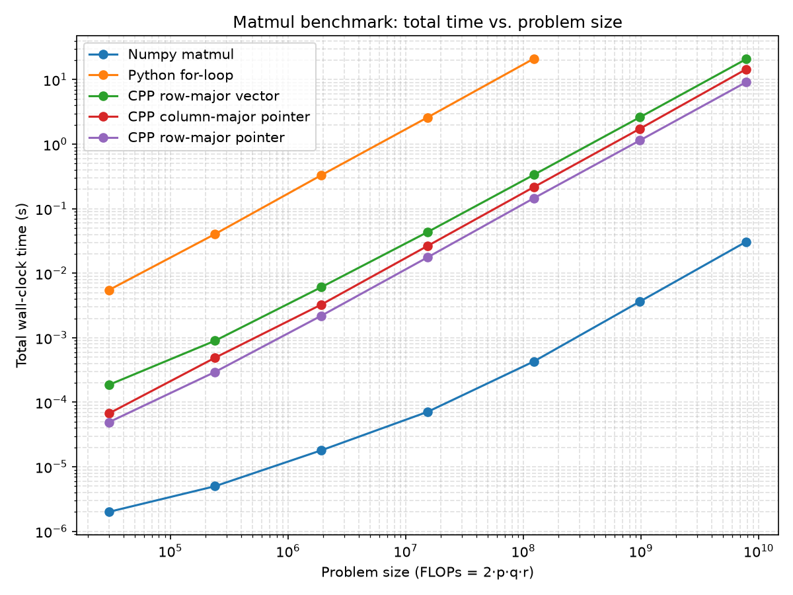
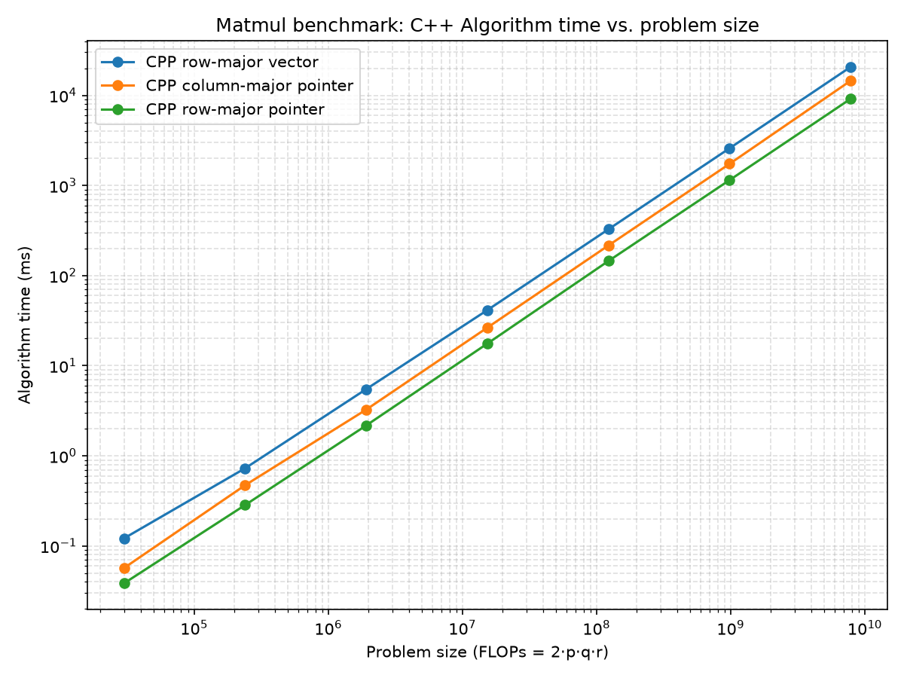

# Benchmark Results

## Implementations compared

| Method | Data structure | Loop order | Notes |
|---|---|---|---|
| NumPy `matmul` | contiguous buffer | BLAS-internal | cache-blocked, SIMD, likely multithreaded |
| Python for-loop | nested `list` | i-j-k | reference baseline, skipped past a certain size |
| CPP row-major vector | `std::vector<std::vector<T>>` | i-k-j | jagged rows, double pointer indirection per access |
| CPP column-major pointer | flat buffer, raw pointer | i-j-k | strided (non-contiguous) inner-loop access on `B` |
| CPP row-major pointer | flat buffer, raw pointer | i-k-j | contiguous inner-loop access on `B` and `C`. |

## Key findings

- **Loop order and memory layout both matter.**
  The column-major pointer method uses a worse loop order (`i-j-k`, strided access into `B`) but still outperforms the row-major vector method, which uses a better loop order (`i-k-j`) but pays for nested-vector indirection, known as **pointer chasing** for 2D arrays.

  *(Pointer-Chasing: Each row of `std::vector<std::vector<T>>` is seperately allocated, so accessing elements requires following an extra pointer before reaching the data, reducing cache efficiency.)*

- **C++ `vector` to Python `list` conversion is expensive on the return path.**
  In the row-major vector method, converting the output matrix from `std::vector<std::vector<T>>` back into a Python `list` costs roughly 0.065ms at the smallest tested size, growing to ~150ms at 3200×1920×640 — a cost the pointer-based methods avoid (under ~0.1ms at every scale).

- **Row-major pointer wins among the custom implementations**, running roughly 37–66% faster than column-major pointer, and 2.3–3.8x faster than the vector-based method. The margin over the vector-based method is largest at small sizes (~3.8x at 50×30×10) and narrows toward ~2.3x as size grows, likely because larger matrix sizes dilute the relative cost of pointer-chasing overhead.

- **NumPy outperforms all naive hand-written implementations...**
  The advantage over the best custom implementation (row-major pointer) grows from roughly 24.5x at the smallest tested size to ~290–340x by 800×480×160 and larger.
  This reflects BLAS-level optimizations — cache blocking/tiling, hand-tuned SIMD kernels, and likely multithreading — that a naive triple loop can't match regardless of loop order or memory layout.

  (*Note: Epoch 0-1 durations are 2-5 microseconds which should be read as the timer's noise*)

- **O(n³) growth**: roughly 8x for each doubling of matrix dimensions, consistent across all C++ methods.

## Benchmark methodology notes

- **Warm-up call before timing; 5 repetitions per epoch, reporting the median.**
    Adding a single warm-up call per method before Epoch 0, then running 5 repetitions per method in each epoch. In each epoch, take the median of wall-clock metrics (`total_s`) from repetitions to prevent timing noise (scheduler preemption, page faults, cache eviction, etc.).

    (*Note: In earlier version, timed each method once per epoch with no warm-up. That run showed NumPy's Epoch 0 duration (~0.314ms) is **slower** than Epoch 1 (0.014ms) despite the FLOP count being 8x larger — a sign that the first call in the benchmark was absorbing one-time costs (**BLAS thread-pool initialization, dynamic symbol resolution, CPU frequency ramp-up, etc.**) which is unrelated to the algorithm itself.*)

- **For CPP methods, `total_s` and `alg_ms` are taken from the same repetition.**
  Pair `total_s` and `alg_ms` in a single repeat, and taking the **median pair** from whole repetitions sorted by `total_s`.

- **All C++ methods accept NumPy arrays (`py::array_t<T>`) as input.**

  (*Note: Earlier versions passed `A.tolist()` / `B.tolist()` to the vector-based method, which added ~1s of hidden Python list-boxing/unboxing overhead outside the actual algorithm cost. Switching to NumPy array input for all methods removed that confound.*)

- **Starts timer immediately before the first operation intrinsic to each method's data representation.**
  For example, the row-major vector method's timer includes the cost of building `std::vector<std::vector<T>>` from the input buffer, since that conversion cost is itself the primary source of that method's overhead relative to the pointer-based methods.

## Charts

## Raw results

`A(p, q) x B(q, r)`, doubling (p, q, r) in each epoch from 50x30x10 up to 3200×1920×640. Each method runs 5 timed repetitions per epoch and its median is shown below. (*Note: "Total" is measured on the Python side; "Alg" is measured internally in C++ around the method's specific algorithm.*)

### Baseline C++ Implementations

C++ methods with loop-order, and data-conversion.

| Epoch | Dimensions (p, q, r) | Numpy matmul Total(s) | Python for-loop Total(s) | CPP row-major vector Total(s) / Alg(s) | CPP column-major pointer Total(s) / Alg(s) | CPP row-major pointer Total(s) / Alg(s) |
| --- | --- | --- | --- | --- | --- | --- |
| 0 | 50x30x10 | 0.000002 | 0.005478 | 0.000186 / 0.000121 | 0.000067 / 0.000057 | 0.000049 / 0.000038 |
| 1 | 100x60x20 | 0.000005 | 0.040482 | 0.000899 / 0.000727 | 0.000490 / 0.000472 | 0.000295 / 0.000284 |
| 2 | 200x120x40 | 0.000018 | 0.330597 | 0.006079 / 0.005497 | 0.003266 / 0.003256 | 0.002193 / 0.002173 |
| 3 | 400x240x80 | 0.000071 | 2.600493 | 0.043420 / 0.041391 | 0.026481 / 0.026461 | 0.017624 / 0.017598 |
| 4 | 800x480x160 | 0.000429 | 21.129925 | 0.334980 / 0.326605 | 0.216006 / 0.215972 | 0.145302 / 0.145273 |
| 5 | 1600x960x320 | 0.003652 | skipped | 2.621090 / 2.588663 | 1.739055 / 1.738990 | 1.147437 / 1.147376 |
| 6 | 3200x1920x640 | 0.030825 | skipped | 20.849647 / 20.699644 | 14.545357 / 14.545291 | 9.163219 / 9.163167 |

### Optimized C++ Approach

*(Work in progress...)C++ methods with blocking/tiling, SIMD intrinsics, threading...*

Full log: [`metrics.log`](metrics.log)

## Next steps

- Cache blocking / tiling for the row-major pointer implementation
- SIMD intrinsics
- Multithreading